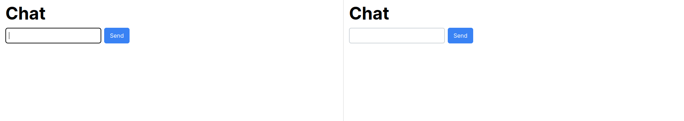

# NextJS + Pusher/Soketi

Near realtime chat app using Pusher/Soketi.

## Use with Pusher

Create a pusher account and create a new app: https://dashboard.pusher.com/

Create a `.env.local` file based on `.env.example` and fill in the values.

Uncomment the `// Pusher config` code blocks in `pusherClient.ts` and `pusherServer.ts`.

Run the NextJS server: `npm run dev`

## Use with Soketi

Install Soketi: https://docs.soketi.app/getting-started/installation/cli-installation

Run Soketi: `SOKETI_DEBUG=1 soketi start`

⚠️ Soketi only works with Node up to version 18 at the moment. Use [NVM](https://github.com/nvm-sh/nvm) to switch versions if needed.

Run the NextJS server: `npm run dev`

## Resources

Tutorial - Realtime Features for React: Easier Than You Think: https://www.youtube.com/watch?v=96YcViCGlRo

Pusher Docs: https://pusher.com/docs/

Pusher SDK Client: https://www.npmjs.com/package/pusher-js

Pusher SDK Server: https://www.npmjs.com/package/pusher

Soketi Docs: https://docs.soketi.app/
